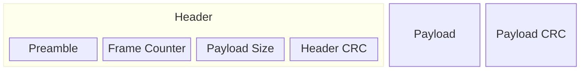

# C Reference Implementation of Compact Frame Format

[](https://github.com/CompactFrameFormat/cff-c/actions/workflows/test.yml)
[](https://github.com/CompactFrameFormat/cff-c/blob/master/LICENSE)

## Overview

Compact Frame Format (CFF) is a way of delineating messages (called the _payload_) in a byte stream. It is designed specifically with Microcontrollers (MCUs) in mind, leading to the following design goals:

1. Take advantage of hardware acceleration like Direct Memory Access (DMA) controllers and the CRC peripherals available on most 32-bit MCUs. This precludes the use of delimiter-based packet boundaries that require the CPU to examine every byte.
2. Exploit the fact that modern serial links are already reliable. Universal Serial Bus (USB), Controller Area Network Bus (CANBus), and Bluetooth Low Energy (BLE), already detect and retransmit lost or corrupted packets. Other serial interfaces like Universal Asynchronous Receiver-Transmitters (UART), Serial Peripheral Interface (SPI), and Inter-Integrated Circuit (I2C) are often reliable in practice, with extremely low error rates when the wiring is short and clean. Therefore, the it's okay for error recovery to be expensive, so long as it's possible and the happy path is cheap. 
3. Easy to implement and debug. Firmware running on MCUs is not amenable to taking dependencies on 3rd party libraries, so the implementation should be small enough to fit comfortably in a single file, and simple enough that you wouldn't mind implementing it yourself if you had to.
4. Interoperate cleanly with binary serialization formats like [FlatBuffers](https://flatbuffers.dev/) and [CBOR](https://cbor.io/).

In CFF, a frame consists of a header, a payload, and a payload CRC.



The header consists of:

* A 2-byte preamble: [0xFA, 0xCE]. Note that this is better though of as an array of two bytes rather than an unsigned short (ushort) because it is transmitted as 0xFA, 0xCE (spelling face), whereas the ushort 0xFACE would be transmitted as 0xCE, 0xFA (spelling  nothing) in little endian.
* A little-endian ushort frame counter which increments for every frame sent and rolls over to 0 after 65,535 (2^16 - 1) frames have been sent.
* A little-endian ushort payload size, in bytes. This gives a theoretical maximum payload size of 65,535, though few MCU-based applications would want to support this. A protocol making use of CFF can enforce smaller maximum payload sizes if desired. Note that this excludes both the header and the payload CRC at the end. In other words, the _frame_ size is `header_size_bytes + payload_size_bytes + crc_size_bytes`.
* A 16-bit header CRC (see below for details) calculated over the preamble, frame counter, and payload size. This allows the receiver to validate the header and, crucially, the payload size without having to read in the entire frame, as would be the case if there were just one CRC, at the end, covering the entire frame. The problem with having a single CRC is that the if the payload size is corrupted in such a way that it is extremely large (65,535 in the pathological case) the reciever will not detect this until it reads that many bytes, calculates the CRC, and discovers that it doesn't match. Depending on the transmitter's data rate at the time of the error, it could take a long time to receive this many bytes, making the issue look like a dropped link. 

Both CRCs are calculated using CRC-16/CCITT-FALSE, with the following settings:

- Width: 16
- Polynomial: 0x1021
- Init: 0xFFFF
- RefIn/RefOut: false / false
- XorOut: 0x0000
- Check("123456789): 0x29B1l

## Usage

To use Compact Frame Format, copy `cff.c` and `cff.h` into your project. 

Here's a complete working example (from [`example/usage_example.c`](https://github.com/CompactFrameFormat/cff-c/blob/main/example/usage_example.c)):

```c
#include "cff.h"
#include <stdio.h>
#include <string.h>

// Callback function to handle parsed frames
void frame_handler(const cff_frame_t *frame)
{
    printf("Received frame %d with %zu byte payload: ", frame->header.frame_counter, frame->payload_size_bytes);

    // Copy payload from ring buffer to linear buffer for printing
    if (frame->payload_size_bytes > 0) {
        uint8_t payload_buffer[256]; // Assume payload won't exceed this size for the example
        cff_error_en_t copy_result = cff_copy_frame_payload(frame, payload_buffer, sizeof(payload_buffer));

        if (copy_result == cff_error_none) {
            // Print payload as string (assuming it's text)
            for (size_t i = 0; i < frame->payload_size_bytes; i++) {
                printf("%c", payload_buffer[i]);
            }
        }
        else {
            printf("[Error copying payload]");
        }
    }
    printf("\n");
}

int main()
{
    // Initialize frame builder with a buffer
    uint8_t build_buffer[256];
    cff_frame_builder_t builder;
    cff_error_en_t result = cff_frame_builder_init(&builder, build_buffer, sizeof(build_buffer));
    if (result != cff_error_none) {
        printf("Failed to initialize frame builder\n");
        return -1;
    }

    // Create a larger buffer to hold multiple frames
    uint8_t frame_stream[512];
    size_t stream_pos = 0;

    // Build multiple frames
    const char *messages[] = {"Hello, World!", "CFF Frame 2", "Final message"};

    for (int i = 0; i < 3; i++) {
        // Build frame with current message
        result = cff_build_frame(&builder, (const uint8_t *) messages[i], strlen(messages[i]));
        if (result != cff_error_none) {
            printf("Failed to build frame %d\n", i);
            return -1;
        }

        // Calculate frame size and copy to stream buffer
        size_t frame_size = cff_calculate_frame_size_bytes(strlen(messages[i]));
        if (stream_pos + frame_size > sizeof(frame_stream)) {
            printf("Stream buffer too small\n");
            return -1;
        }

        memcpy(frame_stream + stream_pos, build_buffer, frame_size);
        stream_pos += frame_size;

        printf("Built frame %d (%zu bytes): \"%s\"\n", i + 1, frame_size, messages[i]);
    }

    printf("\nTotal stream size: %zu bytes\n\n", stream_pos);

    // Parse all frames from the stream using ring buffer
    printf("Parsing frames:\n");

    // Set up ring buffer with the frame stream data
    uint8_t ring_storage[1024]; // Large enough for our example stream
    cff_ring_buffer_t ring_buffer;
    cff_error_en_t ring_result = cff_ring_buffer_init(&ring_buffer, ring_storage, sizeof(ring_storage));
    if (ring_result != cff_error_none) {
        printf("Failed to initialize ring buffer\n");
        return -1;
    }

    // Append stream data to ring buffer
    ring_result = cff_ring_buffer_append(&ring_buffer, frame_stream, (uint32_t) stream_pos);
    if (ring_result != cff_error_none) {
        printf("Failed to append data to ring buffer\n");
        return -1;
    }

    // Parse frames from ring buffer
    size_t parsed_frames = cff_parse_frames(&ring_buffer, frame_handler);

    printf("\nParsed %zu frames from stream\n", parsed_frames);

    return 0;
}
```

You can build and run it using CMake:

```powershell
cd example
mkdir -Force build
cd build
cmake ..
cmake --build .
.\Debug\usage_example.exe
```

## Development

Set up dependencies:
```powershell
# Install Python
winget install --id=Python.Python.3.13 -e # Or any other version greater than 3.8

# Install Ruby
winget install -e --id RubyInstallerTeam.RubyWithDevKit.3.2

# Install Ceedling
gem install ceedling
ceedling -v

# Install CMake (for building examples)
winget install --id=Kitware.CMake -e

# Install ClangFormat
winget install --id=LLVM.ClangFormat -e
```

Clone the repository:
```powershell
git clone https://github.com/CompactFrameFormat/cff-c.git
cd cff-c
pip install pre-commit
pre-commit install
```

### Code Quality

Format code:
```powershell
rake format
```

### Testing

Run the tests:
```powershell
ceedling test:all
```
